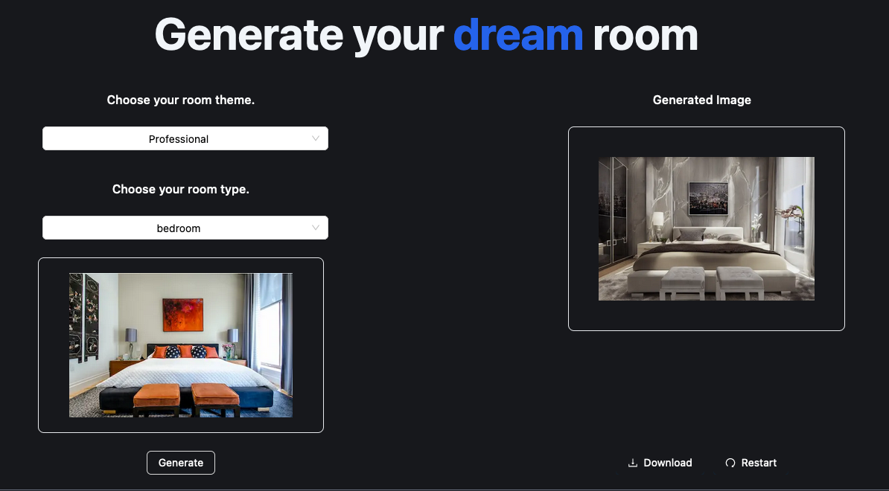

# <div align="center">Room Expert</div>

<div align="center" style="font-weight:bold">Revamp Your Space, Embrace Your Taste</div>
</br>
<div align="center"></div>

# Table of Content:

- [Watch on YouTube](#watch-our-video)
- [Display Shots](#display-shots)
- [Programming Language used ](#programming-language-used)
- [Contact info](#contact-info)
- [Member List and github repo](#member-list-and-github-repos)

## Watch our video

## Display shots

<div align="center"></div>  
<div align="center"></div>  

# Programming language used

Room Expert has been built using the robust T3 Tech Stack and Appwrite for backend operations. The following services
from Appwrite have been leveraged:

**Appwrite Auth**: This has been used for handling user authentication.

**Appwrite Database:** All the relevant data, such as user information and room design preferences, are stored here.

**Appwrite Storage**: This service is used to securely store images uploaded by the users.

Room Expert uses a state-of-the-art **machine learning model called ControlNet**. This model is responsible for
generating different variations of the rooms according to the chosen styles. It intelligently considers the spatial
characteristics and furniture arrangements to offer the most fitting design suggestions.

The **ControlNet model is hosted on Replicate**, which allows us to efficiently manage, version, and deploy the model in
production.

## Try on the website

```
https://room-expert.vercel.app/
```

# Future Scope

- Better our detection for products used to style the room to provide affiliate links to Amazon.
- Make UI more user friendly
- Add more styles to choose from

# Contact info

 ```
vparmar@sfu.ca
 ```

 ```
 aashishvichare10@gmail.com
 ```

# Member list and Github repos

- Aashish :  https://github.com/AshCatchEmAll
- Vatsal : https://github.com/vatsalp98


 

